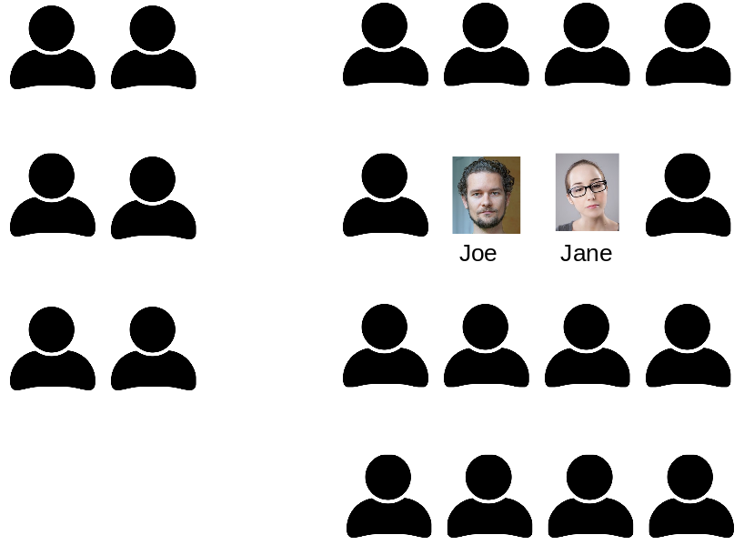

# CPTR220 Midterm Practical Exam

In this take-home exam you will build on the classroom seating chart.
You will build a web based application that collects student information and their seat location and displays it.
Your application should show own CSS styling, valid HTML, PHP programing and form controls.
Here are the specific things your implementation must include.

## Assignment Specifications

You must create a single-page web application that collects student information (name and picture) and their seat location.
You may include other scripts, but the user should only interact with a single index.php script.
The application needs a form to collect the _student name_, _student image_, and _seat location_.
The previously select seats should be show in a nice seating chart display.

You must have the following features:

* The ability add a student to the seating chart with both their name and image.                    
  * Use appropriate input tags for each field.                                                      +++
  * Suggestion: Stored the images by seat assignment in a subdirectory and displayed on the seating chart when available.                                                                                        +++
* The seating chart information should be saved to _seating_chart.csv_.                             +++
* The page should include:                                                                          +++
  * banner image at the top of the page.                                                            +++
  * a link to the course website.                                                                   +++
  * a link to the university website.                                                               +++
  * appropriate language so the user knows how to use the application.                              +++
  * validation links in the footer.                                                                 +++
  * a note saying who created the page in the footer.                                               +++
* Use CSS to style the page and include:                                                            +++
  * Use well-named CSS _classes_ and _identifiers_ (both) as selectors in addition to HTML tags     +++
  * Use at least one pseudo-class selector                                                          +++
* If the seat is taken, do not let the user select this seat.                                       +++

Additional notes:

* Be sure to utilize appropriate web standards and validate your HTML and CSS.
* Before you begin the assignment, estimate the time you believe it will take you to complete the assignment.
    Then log your time and submit both your initial estimate and the final time that it took.

Because this assignment requires that you write PHP code that is interpreted on a web server, you will need use your local web server (from Vagrant) and deploy on your public CS web server.

**Questions?**

Ask your instructor right away so that you don't waste time going down a dead end.